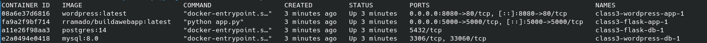
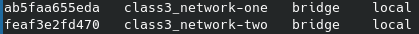
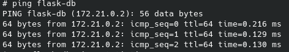
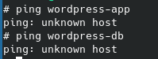

Goal
The main objective is to use docker compose to run two containers on same and different network. 
Understand if they can ping each other in both isolated and same network. 

What is Docker Compose?

Docker Compose lets you define multi-container applications in a single YAML file and run everything with:

```bash
docker compose up -d
```

Instead of manually running:
    4 docker run commands
    2 docker network create commands
    environment variables
    port mappings
    restart policies

Compose automates all of this.

** Run and Test **
Run all the services in one single command. 

```bash
docker compose up -d
```

Check Running containers

```bash
docker ps
```


Check Networks

```bash
docker network ls
```



Check containers communication in same network
flask-app and flask-db are running in network-one



Test Isolated containers communication

wordpress-db and flask-app are running in different networks - network-two and network-one approximately.




